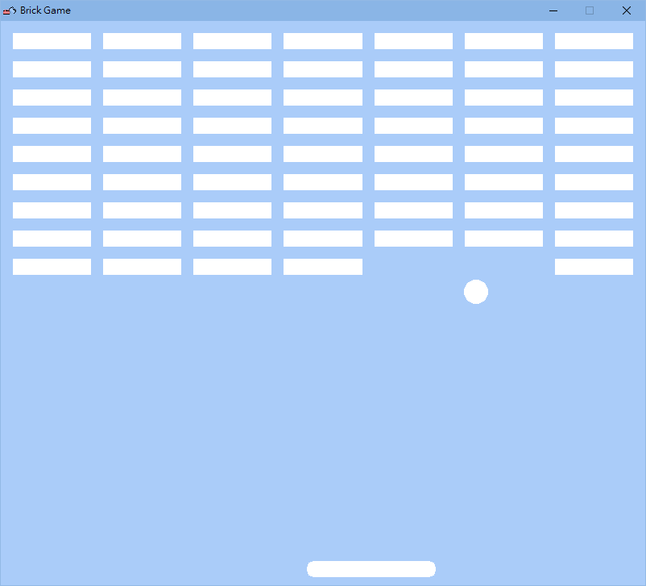
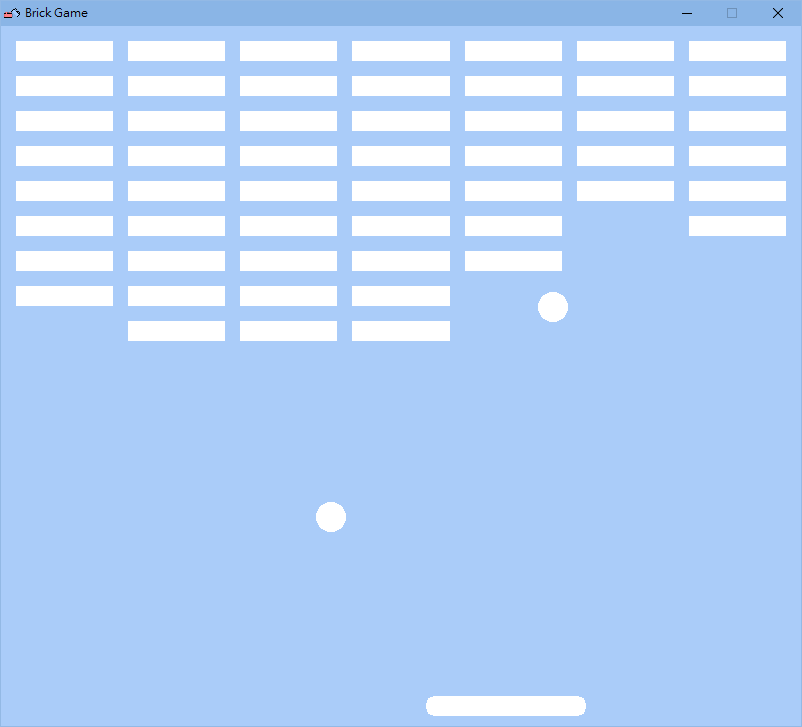
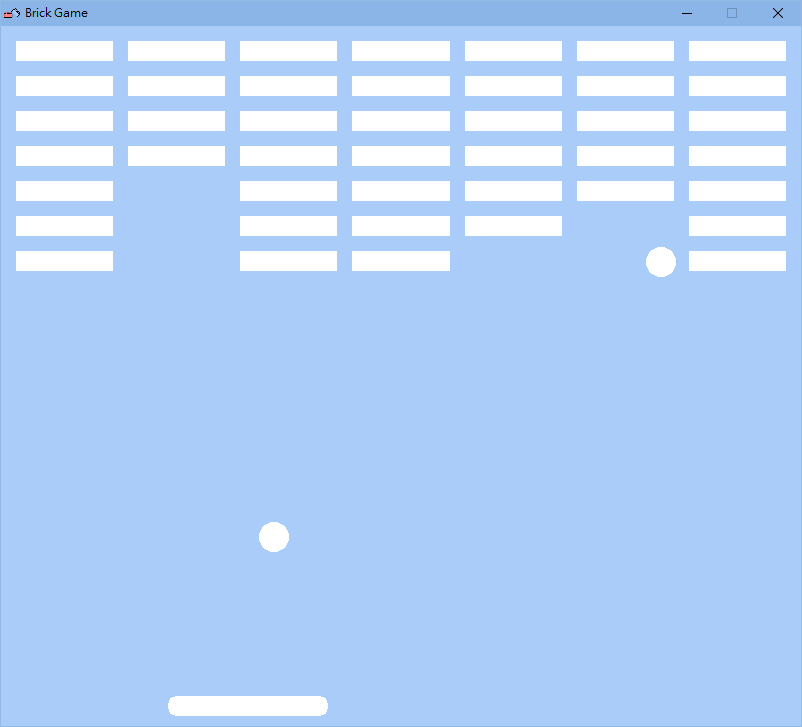

# 打磚塊遊戲 🧱

此專案於 2023 年 8 月製作

本專案為一款經典的打磚塊遊戲，目標是使用板子及彈跳的小球打破一層層磚塊，當分數達特定門檻時，會進入雙球模式。

## 專案截圖 🖥

### 遊戲介面

### 雙球模式

## 使用技術 🔧

- **C++**：進行遊戲邏輯和界面開發

- **Raylib**：一個簡單易用的 C 語言遊戲庫，本專案使用許多 Raylib 提供之 API 進行開發

- **物件導向程式設計**：此遊戲透過物件導向方式撰寫、組織程式碼

## 功能 🚀

- **移動板子**：玩家可以使用鍵盤（左右箭頭鍵）或滑鼠來移動底部的板子

- **雙球模式**：當玩家打破足夠的磚塊後，遊戲將啟動雙球模式，進一步提高挑戰性

- **球自動重置**：如果球掉落到遊戲畫面的底部，將自動重置至初始位置

- **遊戲結束**：當遊戲結束時，會顯示視窗提醒使用者可按 Enter 結束遊戲

## 執行方式 🏃

1. 確保已安裝 `raylib`

2. 編譯並執行 C++ 檔案

3. 使用滑鼠或左右箭頭鍵來移動底部的板子

4. 按下 `ESC` 或 `ENTER` 退出遊戲

## 圖示來源 🌟

[Bricks icons created by Khoirul Huda - Flaticon](https://www.flaticon.com/free-icon/bricks_3274171)